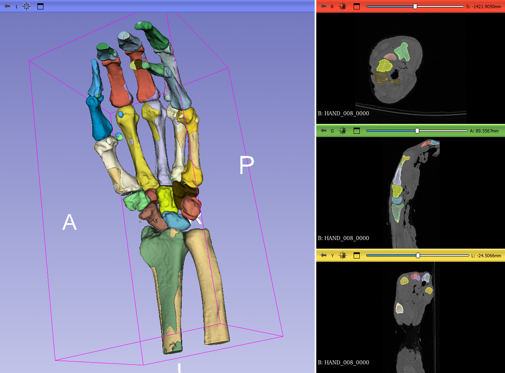
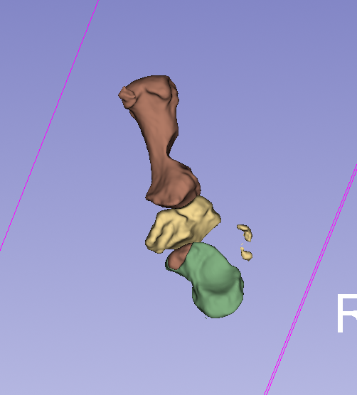
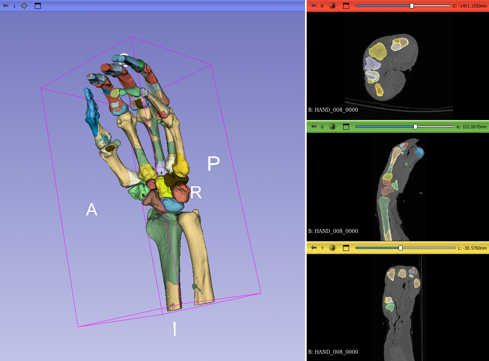

# Hand Bone Segmentation — Sojung's Research

This folder contains my contribution to the hand bone auto-segmentation project: designing, training, and analysing nnU-Net models for CT-based hand and wrist bone segmentation.

---

## 🛠️ Technologies Used

<p align="left">
  
</p>

<p align="left">
  
  
  
  
  
  
  
  
</p>

---

## 📁 File Structure

```
Sojung/
├── baseline-segmentation.ipynb       # Baseline training & inference notebook
├── two-stage-segmentation.ipynb      # 2-stage pipeline implementation
├── baseline-analysis.md              # Baseline results analysis (incl. thumb experiment)
├── two-stage-analysis.md             # 2-stage pipeline analysis
├── dataset.json                      # Dataset configuration
└── src/
    ├── utility.py                    # Shared preprocessing & cropping utilities
    └── img/
        └── wholehand_inf.png         # Baseline inference visualisation
        └── thumb_inf.png             # Baseline inference visualisation
        └── roi_merged_inf.png        # 2-stage inference visualisation
```

---

## 📂 Dataset

**KU Leuven Hand & Wrist CT** — [doi:10.48804/DWF4RG](https://rdr.kuleuven.be/dataset.xhtml?persistentId=doi:10.48804/DWF4RG)

| Property | Value |
|----------|-------|
| Modality | CT |
| Region | Hand & wrist |
| Cases | 6 (5 training, 1 test) |
| Classes | 29 foreground bones + background |
| Voxel spacing | ~0.245 × 0.222 × 0.245 mm |
| Image size | ~461 × 976 × 461 voxels |

Pre-processing included standardising orientation (consistent L/R flip) across all cases before training.

---

## 🔬 Experiments

### 1. Baseline — Whole-Volume Segmentation



Standard nnU-Net `3d_fullres` trained on all 29 bone classes at once, using the full CT volume as input.

| Setting | Value |
|---------|-------|
| Model | nnUNetTrainer_250epochs, `3d_fullres` |
| Architecture | PlainConvUNet, 6-stage encoder-decoder |
| Patch size | 96 × 224 × 96 voxels |
| Epochs | 250 |
| Loss | Dice + Cross-Entropy (deep supervision) |
| Optimizer | SGD (lr=0.01, momentum=0.99, Nesterov) |
| GPU | NVIDIA GeForce RTX 4090 |

**Key results:**

| Bone group | Dice range | Result |
|------------|-----------|--------|
| Carpals (8 bones) | 0.958 – 0.986 | ✅ Excellent |
| Thumb bones | 0.926 – 0.985 | ✅ Good to Excellent |
| Metacarpals 2–5 | 0.725 – 0.834 | ⚠️ Mixed |
| Proximal phalanges | 0.260 – 0.985 | ❌ Highly inconsistent |
| Radius & Ulna | 0.000 – 0.081 | ❌ Critical failure |

**Root causes identified:**
- **Radius/Ulna failure:** Patch size (224 voxels) covers only ~23% of the bone's full longitudinal extent (~976 voxels), so the model never sees the full bone in one patch
- **Finger confusion:** Parallel middle fingers (2/3/4) look identical in local patches — the model cannot tell which finger it is looking at without global positional context

---

### 2. Thumb-Focused Model



A dedicated 3-class model trained only on thumb-proximal bones (Scaphoid, Trapezium, Metacarpal 1), to test whether removing label competition improves thumb accuracy.

| Setting | Value |
|---------|-------|
| Dataset | Dataset100_THUMB |
| Classes | 3 foreground + background |
| Patch size | 112 × 224 × 96 voxels |
| Epochs | 250 |

**Comparison with baseline (test case THUMB_008 vs HAND_008):**

| Bone | Baseline Dice | Thumb-Focused Dice | Δ |
|------|---------------|--------------------|---|
| Scaphoid | 0.986 | 0.968 | −0.018 |
| Trapezium | 0.977 | 0.974 | −0.003 |
| Metacarpal 1 | 0.926 | 0.950 | **+0.024 ↑** |

Metacarpal 1 improved by reducing inter-class competition. Carpals showed minor degradation, likely because the full carpal neighbourhood context was lost.

---

### 3. 2-Stage ROI Pipeline



A two-stage approach designed to give each anatomical subregion its own focused model.

```
Stage 1: Full CT → Whole-hand nnU-Net → Coarse 29-class mask
             ↓
     Compute bounding box per ROI group
             ↓
Stage 2: Cropped sub-volumes → 3 ROI-specific nnU-Nets → Fine masks
             ↓
     Merge ROI predictions → Final full-hand segmentation
```

**3 ROI groups:**

| ROI | Bones |
|-----|-------|
| ThumbROI | Trapezium (7), Scaphoid (3), Metacarpal 1 (11) |
| DigitsMetacarpalsROI | Metacarpals 2–5 (12–15), all phalanges (16–29) |
| CarpalsWristROI | Radius (1), Ulna (2), Carpals (3–10) |

**Problems found:**
- Crops were too large (60–87% of full volume) because bones span the full z-axis
- Overlapping label definitions caused redundant, unfocused crops
- Training labels and merge labels were misaligned, wasting model capacity

**Recommended fixes:**
1. One label in exactly one ROI (no shared labels)
2. Align training labels with merge-responsible labels
3. Consider z-axis spatial splitting instead of anatomical grouping

---

## 📊 Results Summary

| Experiment | Metacarpal 1 | Carpals | Notes |
|------------|-------------|---------|-------|
| Baseline (29-class) | 0.926 | 0.958–0.986 | Radius/ulna complete failure |
| Thumb-focused (3-class) | **0.950** | 0.968–0.974 | +0.024 on MC1, minor carpal drop |
| 2-Stage pipeline | — | — | Crops too large; ROI design needs revision |

---

